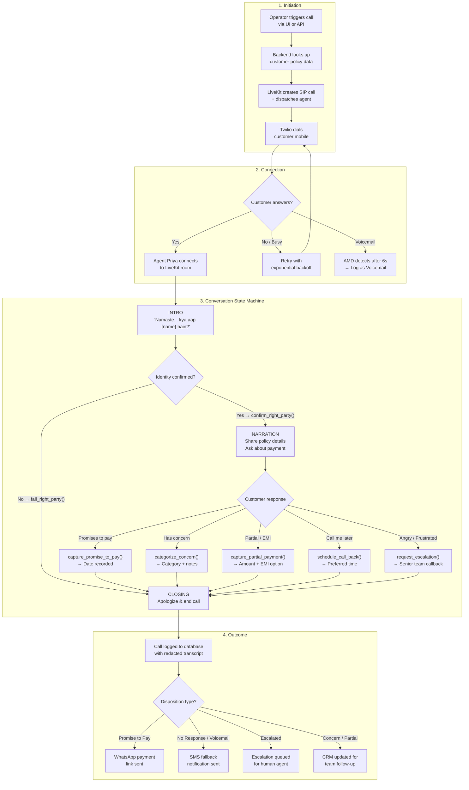
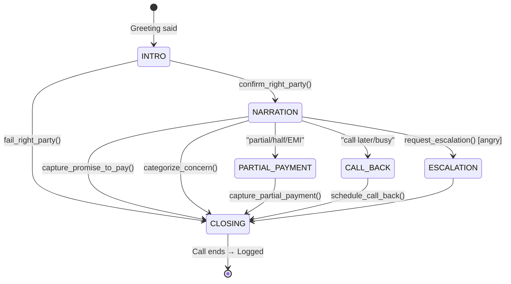

<div align="center">

# PolicyBot

> *AI-powered outbound calling agent for insurance renewal conversations*


---

</div>

## What is PolicyBot?

PolicyBot is an **intelligent voice agent** that makes automated outbound calls to insurance policyholders for renewal follow-ups. It speaks natural Hindi/English (voice: *Priya*), understands customer responses in real-time, and handles the full conversation lifecycle — from greeting to payment commitment to escalation — **without human intervention**.

Built on **[LiveKit Cloud](https://livekit.cloud)** with **[Twilio Elastic SIP Trunk](https://www.twilio.com/en-us/sip-trunking)** for telephony, **[Deepgram Nova-3](https://deepgram.com)** for speech recognition, **[OpenAI GPT-4o-mini](https://openai.com)** for conversation intelligence, and **[Sarvam AI Bulbul v3](https://sarvam.ai)** for natural voice synthesis.

---

## What Does It Do?

| Capability | Detail |
|------------|--------|
| 📞 **Outbound Dialing** | Calls policyholders via Twilio SIP trunk with automatic DND scrubbing and retry logic |
| 🗣️ **Natural Conversation** | Speaks Hindi/English, understands mixed-language responses, adapts tone based on sentiment |
| 🔄 **State Machine** | Guides the call through: Identity Confirmation → Policy Narration → Payment Discussion → Closing |
| 📊 **Smart Outcomes** | Captures promise-to-pay dates, concerns, partial payment commitments, and call-back requests |
| 😠 **Sentiment Awareness** | Detects angry/frustrated customers and escalates to human agent |
| 📱 **WhatsApp Integration** | Sends payment links via WhatsApp when customer commits to pay |
| 📝 **Full Transcripts** | Logs redacted transcripts, dispositions, and recordings to database |
| 📈 **Campaign Mode** | Batch-dials hundreds of customers from CSV with configurable concurrency |

---

## How It Helps Businesses

| Problem | PolicyBot Solution |
|---------|-------------------|
| ❌ **Missed renewals = lost revenue** | Automated follow-ups ensure every policyholder is contacted before due date |
| 👥 **Agents spend 80% time on routine calls** | Handles 100% of first-level renewal conversations — agents only handle escalations |
| 💸 **High agent turnover in call centers** | Zero attrition, consistent script adherence, no training required |
| ⏰ **Can't call 1000+ customers in a day** | Concurrent dialing with smart pacing — scales to hundreds per day |
| 📉 **No data on why customers churn** | Every call produces structured data: concern categories, sentiment, PTP dates |
| 🌐 **Language barriers** | Fluent Hindi/English/Hinglish — matches the customer's language automatically |

---

## Use Cases

- **Insurance Renewal Campaigns** — Auto-dial policyholders 30/15/7 days before premium due date
- **Payment Reminders** — Gentle follow-ups for overdue premiums with promise-to-pay capture
- **Customer Re-engagement** — Reconnect with lapsed policyholders and offer reinstatement
- **Policy Upgrades** — Inform high-value customers about better plans and capture interest
- **Feedback & Surveys** — Post-renewal satisfaction calls with structured data collection
- **Claims Follow-up** — Check in on customers with active claims

---

## Call Flow



---

## State Machine Detail



---

## AI Pipeline

```
Customer Speech ──► Deepgram Nova-3 ──► OpenAI GPT-4o-mini ──► Sarvam Bulbul v3 ──► Customer
     (Mic)             (STT)                  (LLM + Tools)              (TTS)              (Speaker)
                         │                        │                        │
                         ▼                        ▼                        ▼
                   Real-time text          State machine +          Natural Hindi/
                   (Hindi/English)         function calling         English voice
```

---

## Latency Model

| Phase | Duration | Optimization |
|-------|----------|--------------|
| Endpointing (silence detection) | ~400ms | Preemptive generation starts while user still speaking |
| STT (Deepgram Nova-3) | ~300ms | Streaming transcription |
| LLM (GPT-4o-mini) | ~600ms | Pre-generated response available at endpoint |
| TTS (Sarvam Bulbul v3) | ~800ms | Connection pool prewarmed, min_buffer=30 |
| **Total Round-Trip** | **~2s** | — |

---

## Project Structure

```
├── agent.py                 # AI Voice Agent (LiveKit Agent + state machine)
├── logger.py                # Async SQLite call disposition logger
├── dialer.py                # Campaign batch dialer
├── customers.json           # Customer policy database
├── campaign.csv             # Sample campaign file
│
├── backend/
│   ├── main.py              # FastAPI REST API
│   └── database.py          # PostgreSQL models (optional)
│
├── ui/
│   └── app.py               # Chainlit web interface
│
├── docker-compose.yml       # Multi-service deployment
├── .env.example             # Configuration template
└── ARCHITECTURE.md          # Detailed architecture document
```

---

## Quick Start

```bash
# Agent (Terminal 1)
python agent.py dev

# Backend (Terminal 2)
uvicorn backend.main:app --host 0.0.0.0 --port 8000

# UI (Terminal 3)
chainlit run ui/app.py --port 8001

# Or all at once with Docker
docker compose up -d --build
```

---

## Contributions

Contributions are welcome! Here's how you can help:

- 🐛 **Report bugs** — Open a GitHub issue with logs and steps to reproduce
- 💡 **Suggest features** — Open a feature request with a clear use case
- 🔧 **Submit PRs** — Fork the repo, make your changes, and open a pull request
- 📖 **Improve docs** — Fix typos, add examples, clarify instructions
- 🌐 **Add languages** — Help extend support to Tamil, Telugu, Bengali, or other Indian languages

Before contributing, please:
1. Check existing issues to avoid duplication
2. Run `ruff check .` and `python -m pytest` before submitting
3. Update tests if adding new functionality

---

<div align="center">
</div>
